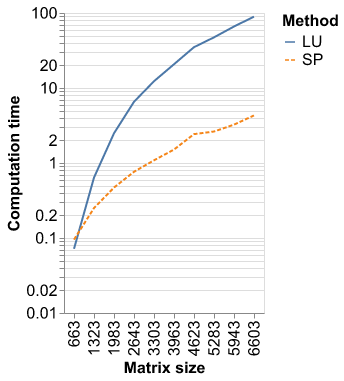

# Summary

The forces on stars, galaxies, and dark matter under external gravitational
fields lead to the dynamical evolution of structures in the universe. The orbits
of these bodies are therefore key to understanding the formation, history, and
future state of galaxies. The field of "galactic dynamics," which aims to model
the gravitating components of galaxies to study their structure and evolution,
is now well-established, commonly taught, and frequently used in astronomy.
Aside from toy problems and demonstrations, the majority of problems require
efficient numerical tools, many of which require the same base code (e.g., for
performing numerical orbit integration).

# Statement of need

`Gala` is an Astropy-affiliated Python package for galactic dynamics. Python
enables wrapping low-level languages (e.g., C) for speed without losing
flexibility or ease-of-use in the user-interface. The API for `Gala` was
designed to provide a class-based and user-friendly interface to fast (C or
Cython-optimized) implementations of common operations such as gravitational
potential and force evaluation, orbit integration, dynamical transformations,
and chaos indicators for nonlinear dynamics. `Gala` also relies heavily on and
interfaces well with the implementations of physical units and astronomical
coordinate systems in the `Astropy` package [@astropy] (`astropy.units` and
`astropy.coordinates`).

`Gala` was designed to be used by both astronomical researchers and by
students in courses on gravitational dynamics or astronomy. It has already been
used in a number of scientific publications [@Pearson:2017] and has also been
used in graduate courses on Galactic dynamics to, e.g., provide interactive
visualizations of textbook material [@Binney:2008]. The combination of speed,
design, and support for Astropy functionality in `Gala` will enable exciting
scientific explorations of forthcoming data releases from the *Gaia* mission
[@gaia] by students and experts alike.

# Mathematics

Single dollars ($) are required for inline mathematics e.g. $f(x) = e^{\pi/x}$

Double dollars make self-standing equations:

$$\Theta(x) = \left\{\begin{array}{l}
0\textrm{ if } x < 0\cr
1\textrm{ else}
\end{array}\right.$$

You can also use plain \LaTeX for equations
\begin{equation}\label{eq:fourier}
\hat f(\omega) = \int_{-\infty}^{\infty} f(x) e^{i\omega x} dx
\end{equation}
and refer to \autoref{eq:fourier} from text.

# Citations

Citations to entries in paper.bib should be in
[rMarkdown](http://rmarkdown.rstudio.com/authoring_bibliographies_and_citations.html)
format.

If you want to cite a software repository URL (e.g. something on GitHub without a preferred
citation) then you can do it with the example BibTeX entry below for @fidgit.

For a quick reference, the following citation commands can be used:
- `@author:2001`  ->  "Author et al. (2001)"
- `[@author:2001]` -> "(Author et al., 2001)"
- `[@author1:2001; @author2:2001]` -> "(Author1 et al., 2001; Author2 et al., 2002)"

# Figures

Figures can be included like this:

and referenced from text using \autoref{fig:example}.

Figure sizes can be customized by adding an optional second parameter:
{ width=20% }

# Profiling

## Raking part

We test several Python functions to solve the linear system $A x = b$:

- numpy.linalg.solve,
- numpy.linalg.svd,
- scipy.sparse.linalg.cg, and
- scipy.sparse.linalg.minres.
  
For scipy.sparse.linalg.cg and scipy.sparse.linalg.minres, we test several values of the parameters:

- $\text{rtol} = 1.0 10^{-5}$ and $\text{maxiter} = None$ (the default values),
- $\text{rtol} = 1.0 10^{-2}$ and $\text{maxiter} = None$
- $\text{rtol} = 1.0 10^{-5}$ and $\text{maxiter} = 100$
- $\text{rtol} = 1.0 10^{-2}$ and $\text{maxiter} = 100$

The linear system is solved once for the raking with the $\chi^2$ distance, but as may times as iterations for the raking wit the entropic distance. As the number of iterations may vary depending on the function used to solve the linear system, we compare the total computing time and the average time per iteration. The size of the matrix A is taken to be equal to the biggest matrix size used in the application part of our previous paper (citation of raking paper here), that is $2289 \times 2289$.
	
| Method | Parameters                                      | Iterations | Total time | Mean time |
| :----- | :---------------------------------------------- | :--------: | :--------: | :-------: |
| solve  |                                                 |  3         |  2.799     | 0.700     |
| SVD    |                                                 |  3         | 17.733     | 4.433     |
| CG     | Default                                         |  3         |  2.028     | 0.507     |
|        | $\text{rtol} = 0.01$                            |  5         |  4.111     | 0.685     |
|        | $\text{maxiter} = 100$                          |  3         |  2.089     | 0.522     |
|        | $\text{rtol} = 0.01$ and $\text{maxiter} = 100$ |  5         |  4.375     | 0.729     |
| MinRes | Default                                         |  6         |  5.887     | 0.841     |
|        | $\text{rtol} = 0.01$                            |  6         |  5.282     | 0.755     |
|        | $\text{maxiter} = 100$                          | 63         | 65.694     | 1.026     |
|        | $\text{rtol} = 0.01$ and $\text{maxiter} = 100$ | 63         | 64.188     | 1.003     |
Table 1: Computation time of the solving methods used for the raking part.

The conjugate gradient method has a smaller computation time and a smaller number of iterations than the other methods tested to solve the linear system. The default values of the parameters lead to the smallest computation time. We choose this method for the raking functions implemented in the package.

## Uncertainty part

We test several Python functions to solve the linear system $A X = B$, where $X4 and $B$ are matrices instead of vectors:

- scipy.sparse.linalg.cg, and 
- scipy.sparse.linalg.spsolve.

We compare the computing time between the two solving methods for different sizes of the matrix $A$. For comparison, in the three examples highlighted in our previous paper, the matrix A had sizes $102 \times 102$, $1158 \times 1158$ and $8385 \times 8385$.

# Acknowledgements

We acknowledge contributions from Brigitta Sipocz, Syrtis Major, and Semyeong
Oh, and support from Kathryn Johnston during the genesis of this project.

# References

# Appendix 1 - Bases for the constraint matrix

## 1D problem

There is just one constraint:

$$\sum_{i = 1}^I \beta_i = s$$

It lead to a $1 \times I$ constraint matrix $A$, which has rank $1$.

## 2D problem

There is one constraint for the margins:

$$\sum_{j = 1}^J s^1_j = \sum_{i = 1}^I s^2_i$$

otherwise the raking problem cannot have a solution.  

The chosen constraints are:

$$\sum_{i = 1}^I \beta_{ij} = s^1_j \quad \forall j = 1 , \cdots , J$$

and:

$$\sum_{j = 1}^J \beta_{ij} = s^2_i \quad \forall i = 1 , \cdots , I - 1$$

It leads to a $\left( I + J - 1 \right) \times \left( I J \right)$ constraint matrix $A$, which has rank $I + J - 1$.  

We need to show that the last constraint $\sum_{j = 1}^J \beta_{Ij} = s^2_I$ is then respected.  

\begin{align}
\sum_{j = 1}^J \beta_{Ij} &= \sum_{j = 1}^J s^1_j - \sum_{i = 1}^{I - 1} \beta_{ij} \\
&= \sum_{j = 1}^J s^1_j - \sum_{i = 1}^{I - 1} \sum_{j = 1}^J \beta_{ij} \\
&= \sum_{j = 1}^J s^1_j - \sum_{i = 1}^{I - 1} s^2_i \\
&= s^2_I
\end{align}

## 3D problem

There are $I + J + K$ constraints for the margins:

$$\sum_{j = 1}^J s^1_{jk} = \sum_{i = 1}^I s^2_{ik} \quad \forall k = 1 , \cdots , K$$

$$\sum_{k = 1}^K s^2_{ik} = \sum_{j = 1}^J s^3_{ij} \quad \forall i = 1 , \cdots , I$$

$$\sum_{i = 1}^I s^3_{ij} = \sum_{k = 1}^K s^1_{jk} \quad \forall j = 1 , \cdots , J$$

otherwise the raking problem cannot have a solution.

The chosen constraints are:

$$\sum_{i = 1}^I \beta{ijk} = s^1_{jk} \quad \forall j = 1 , \cdots , J - 1 \text{ and } \forall k = 1 , \cdots , K$$

$$\sum_{j = 1}^J \beta{ijk} = s^2_{ik} \quad \forall k = 1 , \cdots , K - 1 \text{ and } \forall i = 1 , \cdots , I$$

$$\sum_{k = 1}^K \beta{ijk} = s^3_{ij} \quad \forall i = 1 , \cdots , I - 1 \text{ and } \forall j = 1 , \cdots , J$$

$$\sum_{i = 1}^I \beta_{iJK} = s^1_{JK}$$

It leads to a $\left( I J + I K + J K - I - J - K + 1 \right) \times \left( I J K \right)$ constraint matrix $A$, which has rank $I J + I K + J K - I - J - K + 1$.  

1. We need to show that $\sum_{i = 1}^I \beta_{iJk} = s^1_{Jk} \quad \forall k = 1 , \cdots , K - 1$.

\begin{align}
\sum_{i = 1}^I \beta_{iJk} &= \sum_{i = 1}^I s^2_{ik} - \sum_{j = 1}^{J - 1} \beta_{ijk} \\
&= \sum_{i = 1}^I s^2_{ik} - \sum_{j = 1}^{J - 1} \sum_{i = 1}^I \beta_{ijk} \\
&= \sum_{i = 1}^I s^2_{ik} - \sum_{j = 1}^{J - 1} s^1_{jk} \\
&= s^1_{Jk}
\end{align}

2. We need to show that $\sum_{k = 1}^K \beta_{Ijk} = s^3_{Ij} \quad \forall j = 1 , \cdots , J$.

\begin{align}
\sum_{k = 1}^K \beta_{Ijk} &= \sum_{k = 1}^K s^1_{jk} - \sum_{i = 1}^{I - 1} \beta_{ijk} \\
&= \sum_{k = 1}^K s^1_{jk} - \sum_{i = 1}^{I - 1} \sum_{k = 1}^K \beta_{ijk} \\
&= \sum_{k = 1}^K s^1_{jk} - \sum_{i = 1}^{I - 1} s^3_{ij} \\
&= s^3_{Ij}
\end{align}

3. We need to show that $\sum_{j = 1}^J \beta_{ijK} = s^2_{iK} \quad \forall i = 1 , \cdots , I$.

\begin{align}
\sum_{j = 1}^J \beta_{ijK} &= \sum_{j = 1}^J s^3_{ij} - \sum_{k = 1}^{K - 1} \beta_{ijk} \\
&= \sum_{j = 1}^J s^3_{ij} - \sum_{k = 1}^{K - 1} \sum_{j = 1}^J \beta_{ijk} \\
&= \sum_{j = 1}^J s^3_{ij} - \sum_{k = 1}^{K - 1} s^2_{ik} \\
&= s^2_{iK}
\end{align}

## USHD problem

There is one constraint for the margins:

$$\sum_{i = 1}^I s_i = s_0$$

otherwise the raking problem cannot have a solution.  

The chosen constraints are:

$$\sum_{k = 1}^K \beta_{i0k} = s_i \quad \forall i = 1 , \cdots , I$$

$$\sum_{i = 1}^I \beta_{i0k} - \beta_{00k} = 0 \quad \forall k = 1 , \cdots , K$$

$$\sum_{j = 1}^J \beta_{0jk} - \beta_{00k} = 0 \quad \forall k = 1 , \cdots , K$$

$$\sum_{i = 1}^I \beta_{ijk} - \beta_{0jk} = 0 \quad \forall j = 1 , \cdots , J \text{ and } \forall k = 1 , \cdots , K$$

$$\sum_{j = 1}^J \beta_{ijk} - \beta_{i0k} = 0 \quad \forall i = 1 , \cdots , I - 1  \text{ and } \forall k = 1 , \cdots , K$$

It leads to a $\left( I + \left( I + J + 1 \right) K \right) \times \left( (I + 1) (J + 1) K \right)$ constraint matrix $A$, which has rank $I + \left( I + J + 1 \right) K$.  

1. We need to show that $\sum_{k = 1}^K \beta_{00k} = s_0$.

\begin{align}
\sum_{k = 1}^K \beta_{00k} &= \sum_{k = 1}^K \sum_{i = 1}^I \beta_{i0k} \\
&= \sum_{i = 1}^I \sum_{k = 1}^K \beta_{i0k} \\
&= \sum_{i = 1}^I s_i \\
&= s_0
\end{align}

2. We need to show that $\sum_{j = 1}^J \beta_{I,j,k} - \beta_{I,0,k} = 0 \quad \forall k = 1 , \cdots , K$.

\begin{align}
\sum_{j = 1}^J \beta_{Ijk} &= \sum_{j = 1}^J \left( \beta_{0jk} - \sum_{i = 1}^{I - 1} \beta_{ijk} \right) \\
&= \sum_{j = 1}^J \beta_{0jk} - \sum_{i = 1}^{I - 1} \sum_{j = 1}^J \beta_{ijk} \\
&= \beta_{00k} - \sum_{i = 1}^{I - 1} \beta_{i0k} \\
& = \beta_{I0k}
\end{align}

## USHD problem (lower levels)

There are $1 + K$ constraints for the margins:

$$\sum_{i = 1}^I s_{cause,i} = \sum_{k = 1}^K s_{county,k}$$

$$\sum_{j = 1}^J s_{all,jk} = s_{county,k} \quad \forall k = 1 , \cdots , K$$

otherwise the raking problem cannot have a solution.  

The chosen constraints are:

$$\sum_{k = 1}^K \beta_{i0k} = s_{cause,i} \quad \forall i = 1 , \cdots , I$$

$$\sum_{i = 1}^I \beta_{i0k} = s_{county,k} \quad \forall k = 1 , \cdots , K - 1$$

$$\sum_{i = 1}^I \beta_{ijk} = s_{all,jk} \quad \forall j = 1 , \cdots , J \text{ and } k = 1 , \cdots , K$$

$$\sum_{j = 1}^J \beta_{ijk} - \beta_{i0k} = 0 \quad \forall i = 1 , \cdots , I - 1 \text{ and } k = 1 , \cdots , K$$

It leads to a $\left( I + K + I K + J K - K - 1 \right) \times \left( I (J + 1) K \right)$ constraint matrix $A$, which has rank $I + K + I K + J K - K - 1$.  

1. We need to show that $\sum_{i = 1}^I \beta_{i0K} = s_{county,K}$.

\begin{align}
\sum_{i = 1}^I \beta_{i0K} &= \sum_{i = 1}^I s_{cause,i} - \sum_{k = 1}^{K - 1} \beta_{i0k} \\
&= \sum_{k = 1}^K s_{county,k} - \sum_{i = 1}^I \sum_{k = 1}^{K - 1} \beta_{i0k} \\
&= s_{county,K} + \sum_{k = 1}^{K - 1} s_{county,k} - \sum_{i = 1}^I\beta_{i0k} \\
&= s_{county,K}
\end{align}

2. We need to show that $\sum_{j = 1}^J \beta_{Ijk} - \beta_{I0k} = 0 \forall k = 1 , \cdots , K$.

\begin{align}
\sum_{j = 1}^J \beta_{Ijk} &= \sum_{j = 1}^J s_{all,jk} - \sum_{i = 1}^{I - 1} \beta_{ijk} \\
&= s_{county,k} - \sum_{i = 1}^{I - 1} \sum_{j = 1}^J \beta_{ijk} \\
&= s_{county,k} - \sum_{i = 1}^{I - 1} \beta_{i0k} \\
&= \beta_{I0k}
\end{align}

