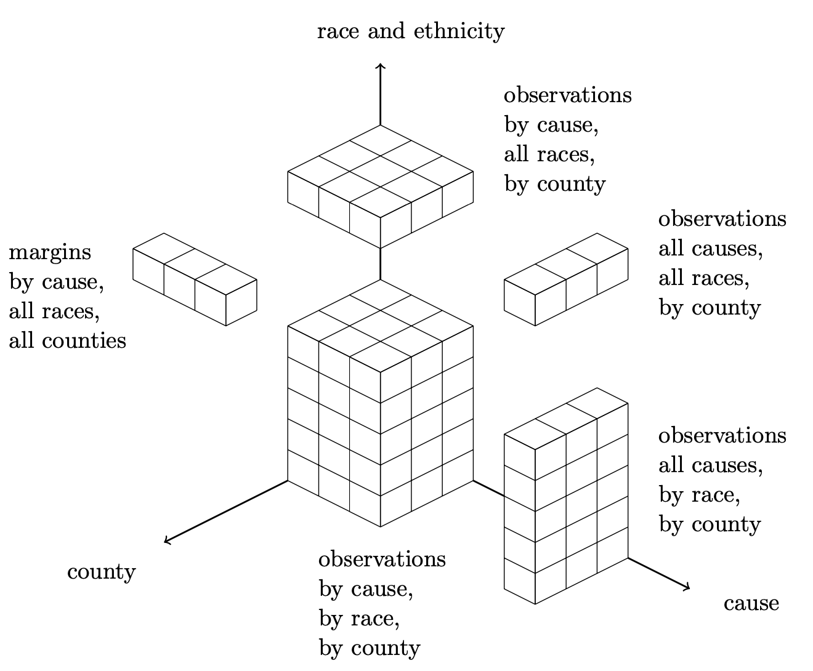
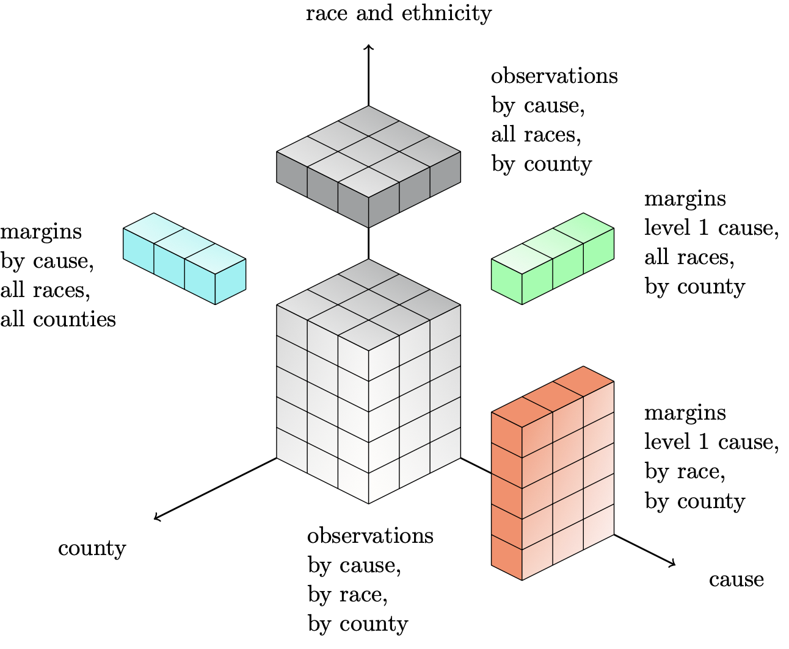

Special cases
=======================

We included other versions of the raking with specific constraints that are more complex than the 1D, 2D or 3D cases.

USHD raking
-----------

    Raking the deaths count over cause, race and county.

In that case, the only known margins are the GBD values for the number of deaths at the state level for each cause of death.

The observations data frame looks like this:

=====  ====== ====== ======
value  cause  race   county
=====  ====== ====== ======
float  string string string
float  string string string
float  string string string
float  string string string
=====  ====== ====== ======

It should include the all causes value (cause='_all') for each race (including all races) and county and the all races value (race=1) for each cause (including all causes) and county.

The margins data frame look like this:

===== ==========================
cause value_agg_over_race_county
===== ==========================
_all  float
_comm float
_inj  float
_ncd  float
===== ==========================

It contains the GBD values.

The inputs of the raking function are similar to the 1D, 2D and 3D cases:

* dim: Enter 'USHD'.
* df_obs: Enter the pandas data frame containing the observations. It must be formatted as explained above.
* df_margins: Enter a list of containing the margins data frame. It must be formatted as explained above.
* var_names: Enter None.
* margin_names: Enter a list containing the names of the categories corresponding to all causes deaths, all races deaths and all counties deaths. Example: ['_all', 1, 0]

USHD raking (lower levels)
--------------------------

    Raking the deaths count over cause, race and county.

In that case, the margins are the GBD values for the number of deaths at the state level for each cause of death, and the already raked values for the level 1 cause (by race and by county and all races, by county).

The observations data frame looks like this:

=====  ====== ====== ======
value  cause  race   county
=====  ====== ====== ======
float  string string string
float  string string string
float  string string string
float  string string string
=====  ====== ====== ======

It should include values for each cause, each race and each county and the all races value (race=1) for each cause and county.

The first margin data frame look like this:

========== ==========================
cause      value_agg_over_race_county
========== ==========================
_intent    float
_unintent  float
_inj_trans float
========== ==========================

It contains the GBD values for the level 2 causes.

The second margin data frame look like this:

====== =========================
county value_agg_over_cause_race
====== =========================
string float
string float
string float
====== =========================

It contains the raked values for the level 1 cause (all races).

The third margin data frame look like this:

====== ====== ====================
race   county value_agg_over_cause
====== ====== ====================
string string float
string string float
string string float
====== ====== ====================

It contains the raked values for the level 1 cause for each race.

The inputs of the raking function are similar to the 1D, 2D and 3D cases:

* dim: Enter 'USHD_lower'.
* df_obs: Enter the pandas data frame containing the observations. It must be formatted as explained above.
* df_margins: Enter a list of containing the margins data frames. They must be formatted as explained above.
* var_names: Enter None.
* margin_names: Enter a list containing the name of the category corresponding to all causes deaths, all races deaths and all counties deaths. Example: ['_inj', 1, 0]
