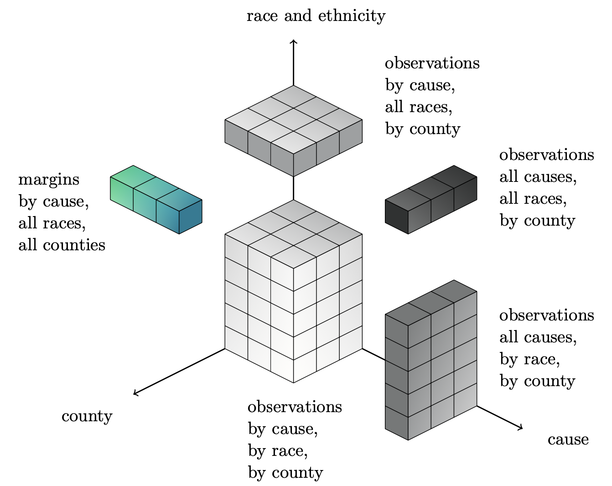

Special cases
=======================

We included other versions of the raking with specific constraints that are more complex than the 1D, 2D or 3D cases.

USHD raking
-----------

    Raking the deaths count over cause, race and county.

In that case, the only known margins are the GBD values for the number of deaths at the state level for each cause of death.

The observations data frame looks like this:

=====  ====== ====== ======
value  cause  race   county
=====  ====== ====== ======
float  string string string
float  string string string
float  string string string
float  string string string
=====  ====== ====== ======

It should include the all causes value (cause='_all') for each race (including all races) and county and the all races value (race=0) for each cause (including all causes) and county. The all causes value is denoted by cause = '_all', you must make sure that all other causes sorted in alphabetical order will be ranked after '_all' (e.g. '_comm', '_inj' and '_ncd' will work). The all races value is denoted by race = 0, you must make sure that all other races sorted in ascending order will be ranked after 0 (e.g. 1, 2, 3, 4 and 7 will work).

The margins data frame look like this:

===== ==========================
cause value_agg_over_race_county
===== ==========================
_all  float
_comm float
_inj  float
_ncd  float
===== ==========================

It contains the GBD values.

The inputs of the raking function are similar to the 1D, 2D and 3D cases:

* dim: Enter 'USHD'.
* df_obs: Enter the pandas data frame containing the observations. It must be formatted as explained above.
* df_margins: Enter a list of containing the margins data frame. It must be formatted as explained above.
* var_names: Enter None.
