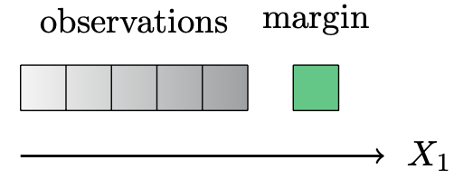
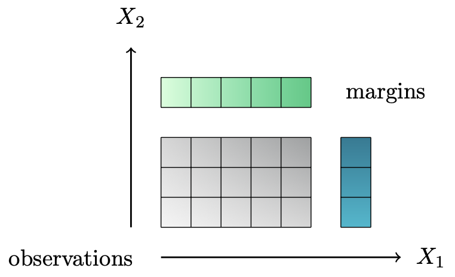

What is raking?
===============

The objective of raking is to adjust the values in a contingency table so that they add up to known margins.

Raking with one categorical variable
------------------------------------

    Raking with one categorical variable

In this case, there is only one margin and the observations must be adjusted to add up to the known margin. We want the raked values to respect the condition:

.. math::
    \sum_{i = 1}^I \beta_i = s

Raking with two categorical variables
-------------------------------------

    Raking with two categorical variables

In this case, the margins are the sums over the rows and the sums over the columns and we want to adjust the observations in the table so they add up correctly to the known row sums and column sums. We want the raked values to respect the conditions:

.. math::
    \sum_{i = 1}^I \beta_{ij} = s^1_j \quad \forall j = 1 , \cdots , J

.. math::
    \sum_{j = 1}^J \beta_{ij} = s^2_i \quad \forall i = 1 , \cdots , I

Note that in this case, we need the margins to respect the condition:

.. math::
    \sum_{j = 1}^J s^1_j = \sum_{i = 1}^I s^2_i

otherwise the problem does not have a solution.

Raking with three categorical variables
---------------------------------------

    Raking with three categorical variables

In this case, the margins are the sums over the three directions and we want to adjust the observations in the cube so they add up correctly to the known sums. We want the raked values to respect the conditions:

.. math::
    \sum_{i = 1}^I \beta{ijk} = s^1_{jk} \quad \forall j = 1 , \cdots , J \text{ and } \forall k = 1 , \cdots , K

.. math::
    \sum_{j = 1}^J \beta{ijk} = s^2_{ik} \quad \forall i = 1 , \cdots , I \text{ and } \forall k = 1 , \cdots , K

.. math::
    \sum_{k = 1}^K \beta{ijk} = s^3_{ij} \quad \forall i = 1 , \cdots , I \text{ and } \forall j = 1 , \cdots , J

Note that in this case, we need the margins to respect the conditions:

.. math::
    \sum_{j = 1}^J s^1_{jk} = \sum_{i = 1}^I s^2_{ik} \quad \forall k = 1 , \cdots , K

.. math::
    \sum_{k = 1}^K s^2_{ik} = \sum_{j = 1}^J s^3_{ij} \quad \forall i = 1 , \cdots , I

.. math::
    \sum_{i = 1}^I s^3_{ij} = \sum_{k = 1}^K s^1_{jk} \quad \forall j = 1 , \cdots , J

otherwise the problem does not have a solution.

Raking from level 1 to level 0 cause (USHD use case)
----------------------------------------------------

.. figure:: figures/raking_USHD.png

    Raking deaths by cause i, race j and county k to the GBD state values by cause

In this case, the margins are the number of deaths for each cause and all races at the state level:

.. math::
    \sum_{k = 1}^K \beta_{i0k} = s_i \quad \forall i = 1 , \cdots , I

We also want the observations to respect the internal sums:

.. math::
    \sum_{i = 1}^I \beta_{i0k} = \beta_{00k} \quad \forall k = 1 , \cdots , K

.. math::
    \sum_{j = 1}^J \beta_{0jk} = \beta_{00k} \quad \forall k = 1 , \cdots , K

.. math::
    \sum_{i = 1}^I \beta_{ijk} = \beta_{0jk} \quad \forall j = 1 , \cdots , J \text{ and } \forall k = 1 , \cdots , K

.. math::
    \sum_{j = 1}^J \beta_{ijk} = \beta_{i0k} \quad \forall i = 1 , \cdots , I  \text{ and } \forall k = 1 , \cdots , K

Note that in this case, we need the margins to respect the condition:

.. math::
    \sum_{i = 1}^I s_i = s_0

otherwise the problem does not have a solution.

Raking from level 2 to level 1 cause (USHD use case)
----------------------------------------------------

.. figure:: figures/raking_USHD_lower.png

    Raking deaths by cause i, race j and county k to the GBD state values by cause, and to the already raked values for level 1 cause by race and county, and all races by county.

In this case, the margins are the number of deaths for each cause and all races at the state level, and the number of deaths for the level 1 cause for each race and all races and for each county:

.. math::
    \sum_{k = 1}^K \beta_{i0k} = s_{cause,i} \quad \forall i = 1 , \cdots , I

.. math::
    \sum_{i = 1}^I \beta_{i0k} = s_{county,k} \quad \forall k = 1 , \cdots , K

.. math::
    \sum_{i = 1}^I \beta_{ijk} = s_{all causes,jk} \quad \forall j = 1 , \cdots , J \text{ and } \forall k = 1 , \cdots , K

We also want the observations to respect the internal sums:

.. math::
    \sum_{j = 1}^J \beta_{ijk} = \beta_{i0k} \quad \forall i = 1 , \cdots , I  \text{ and } \forall k = 1 , \cdots , K

Note that in this case, we need the margins to respect the conditions:

.. math::
    \sum_{j = 1}^J s_{all causes,jk} = s_{county,k} \quad \forall k = 1 , \cdots , K

.. math::
    \sum_{i = 1}^I s_{cause,i} = \sum_{k = 1}^K s_{county,k}

otherwise the problem does not have a solution.
